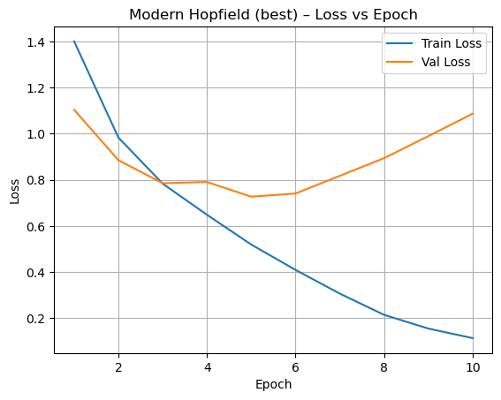

# Modern Hopfield Network Image Classifier: CIFAR-10

[](https://colab.research.google.com/github/AsserGharib1/ModernHopfieldCifar10DL/blob/main/modern_hopfield_cifar10.ipynb)
[](https://nbviewer.org/github/AsserGharib1/ModernHopfieldCifar10DL/blob/main/modern_hopfield_cifar10.ipynb)

PyTorch implementation of a **Modern (continuous) Hopfield Network** classifier with energy-based update rules, trained and evaluated on the 60,000-image CIFAR-10 dataset, including sparse variants and a comparison against baseline deep classifiers.

## Results (best sparse variant, validation)

| Metric | Score |
|---|---|
| Accuracy | **75.23%** |
| F1 score | 0.7352 |
| ROC-AUC | **0.9670** |

Full confusion matrix and per-variant comparisons (sparse variants A/B/C vs baselines) are preserved in the notebook. For an associative-memory architecture on raw CIFAR-10, no convolutional backbone, this is a solid result, and the point of the exercise: implementing and understanding modern Hopfield attention-style retrieval (Ramsauer et al., *Hopfield Networks is All You Need*, 2020) rather than chasing SOTA.

## Training curves




## Inside

Custom `SparseHopfieldLayer` / `SparseHopfieldNet` modules, continuous-embedding preprocessing, seeded splits, accuracy / precision / recall / F1 / ROC-AUC evaluation, TensorBoard-compatible logging.

```bash
pip install -r requirements.txt
jupyter notebook modern_hopfield_cifar10.ipynb
```
